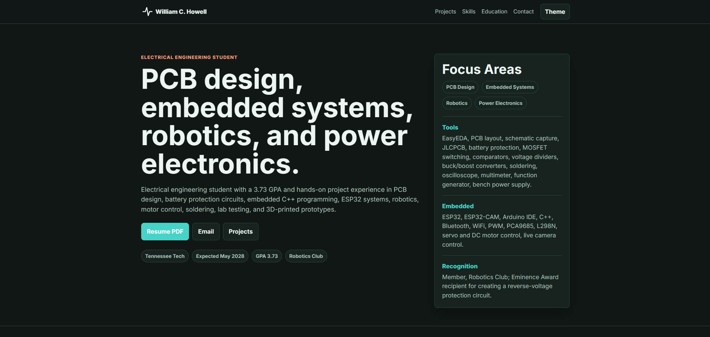

# wchowellarchive

Status: Active portfolio archive

wchowellarchive is Carter Howell's public engineering portfolio and project archive. It collects hardware, embedded systems, PCB, robotics, software-support, and older archive projects in one place so each project can be understood beyond a short resume bullet.

## Live Portfolio

[wchowellarchive.web.app](https://wchowellarchive.web.app)

## Purpose

The portfolio acts as a public index of Carter's engineering work. It gives project context, photos, documentation links, and repository links for work that is useful to show publicly.

The strongest role of the site is to support the larger professional narrative:

> Electrical engineering student building toward embedded systems, PCB design, robotics, product development, power electronics, and engineering automation.

## Project Focus

The archive is organized to keep electrical and product-oriented work visible first while still preserving older software and learning projects.

Current emphasis:

- ESP32-based robotics and embedded control
- PCB design, battery protection, and power distribution
- Hardware/software/mechanical integration
- Engineering automation and AI-assisted EDA workflows
- Supporting software tools and cloud-connected project infrastructure

## Repository Scope

This repository is intentionally a public project exhibit, not the deployment source for the live website.

It is kept lightweight so visitors can understand what the portfolio is, why it exists, and where to view it without browsing through static site implementation files or deployment configuration.

## Featured Work

The portfolio currently highlights projects such as:

- DIY Wall-E Robot
- Low-Voltage Cutoff PCB
- Dual Robotic Arms
- Web-Controlled RC Car
- AI-assisted PCB design and EDA automation work
- Supporting software and older archive projects

## Maintenance Notes

The live portfolio should continue evolving as stronger engineering work is completed. Future updates should prioritize measured results, cleaner project photos, schematics, PCB renders, firmware architecture, and revision history for hardware projects.

Software projects can remain visible, but they should support the electrical-engineering and product-development story rather than dominate the portfolio.
